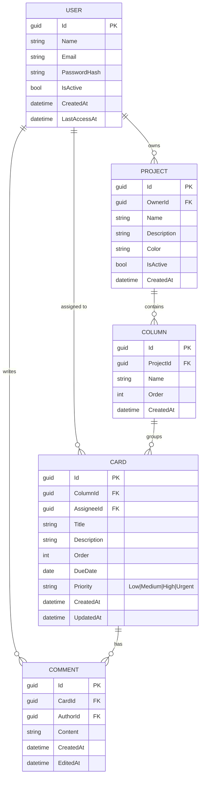
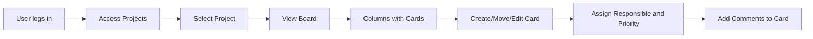

# Board de Tarefas — Modelo de Dados

## Diagrama ER

---

## Relacionamentos

| Relation | Type | Description |
|---|---|---|
| User → Project | 1:N | A user can own multiple projects |
| User → Card | 1:N | A user can be assigned to multiple cards |
| User → Comment | 1:N | A user can write multiple comments |
| Project → Column | 1:N | A project has multiple columns (e.g. To Do, Doing, Done) |
| Column → Card | 1:N | A column groups multiple cards |
| Card → Comment | 1:N | A card can have multiple comments |

---

## Fluxo Principal

